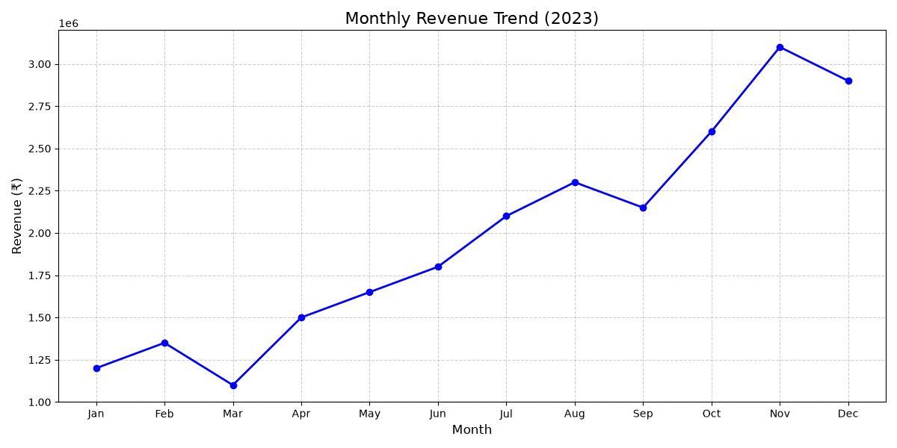
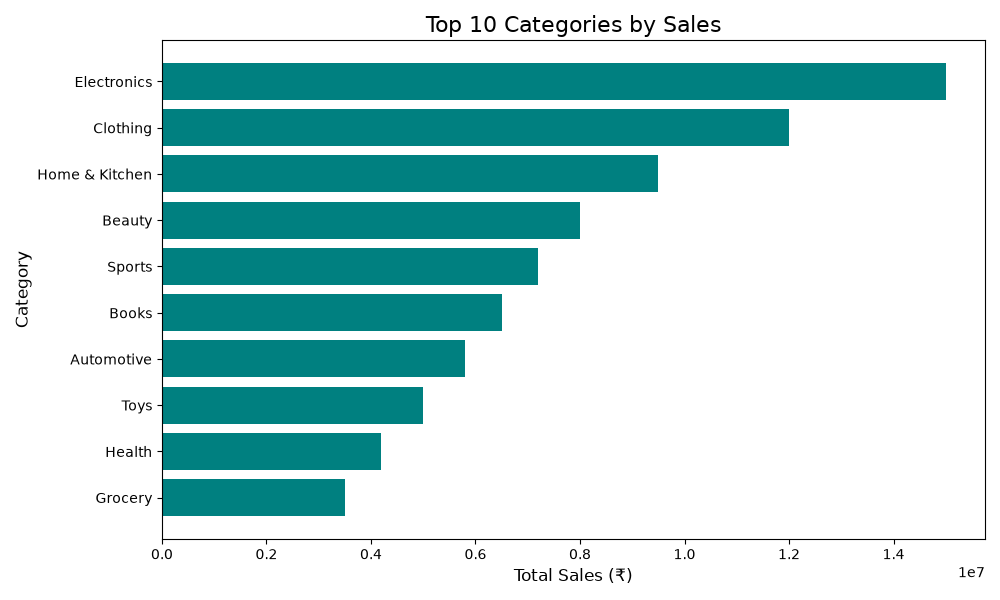
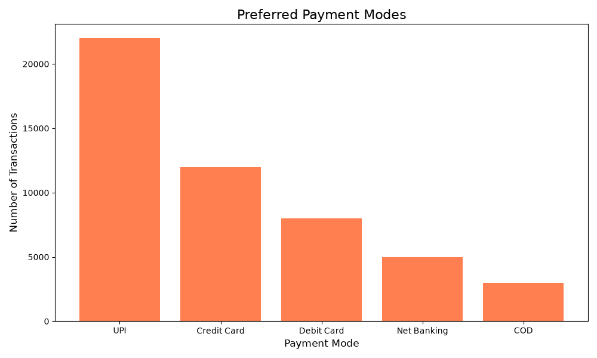
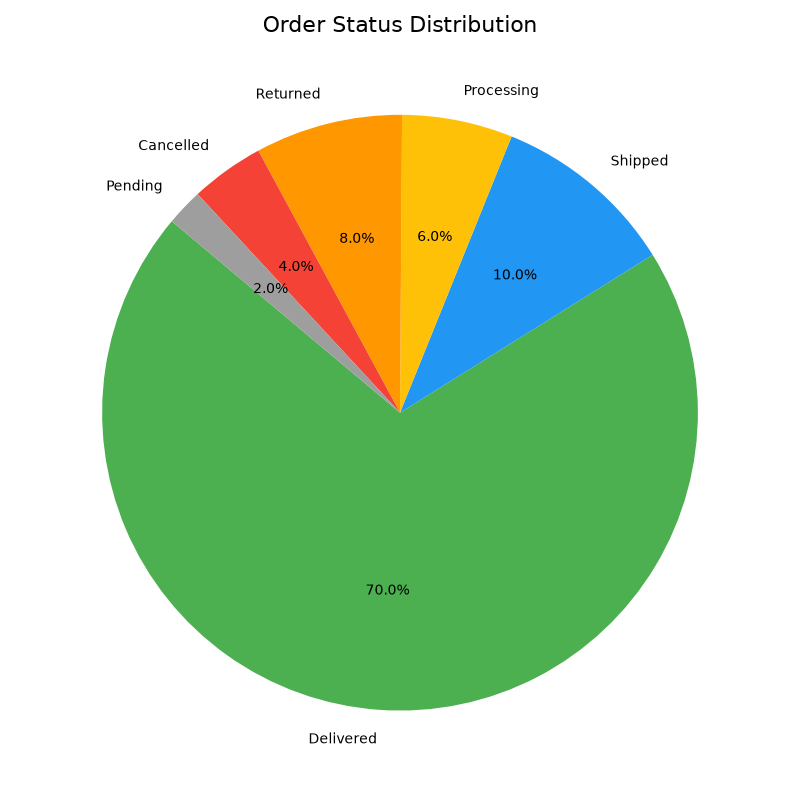
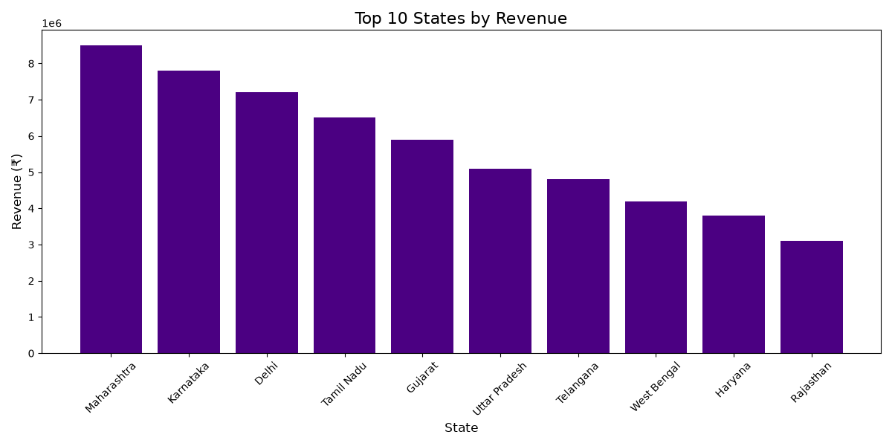

# Indian E-Commerce SQL Data Analysis Project

 


## 📌 Project Overview
This project is an end-to-end SQL Data Analysis solution for a simulated Indian E-Commerce platform (resembling Flipkart or Amazon India). It encompasses everything from designing a normalized database schema and generating 100,000+ realistic synthetic records, to writing 50+ complex SQL queries and visualizing the insights using Python.

The goal of this project is to demonstrate advanced SQL proficiency, database architecture, business problem-solving, and data visualization skills, making it a robust portfolio piece for Data Analyst roles.

---

## 🗄️ Database Design & Schema

The database is normalized to the 3rd Normal Form (3NF) to ensure data integrity and reduce redundancy. It consists of 8 primary tables with established Primary and Foreign Key relationships.

### ER Diagram

```mermaid
erDiagram
    CUSTOMERS ||--o{ ORDERS : places
    ORDERS ||--|{ ORDER_ITEMS : contains
    ORDERS ||--o| PAYMENTS : processes
    PRODUCTS ||--o{ ORDER_ITEMS : includes
    CATEGORIES ||--o{ PRODUCTS : categorizes
    SUPPLIERS ||--o{ PRODUCTS : supplies
    EMPLOYEES ||--o{ EMPLOYEES : manages

    CUSTOMERS {
        int customer_id PK
        varchar first_name
        varchar last_name
        varchar email
        varchar phone
        varchar address
        varchar city
        varchar state
        varchar pin_code
        date registration_date
    }
    ORDERS {
        int order_id PK
        int customer_id FK
        timestamp order_date
        numeric total_amount
        varchar order_status
        varchar delivery_city
        varchar delivery_state
    }
    ORDER_ITEMS {
        int order_item_id PK
        int order_id FK
        int product_id FK
        int quantity
        numeric unit_price
        numeric total_price
    }
    PRODUCTS {
        int product_id PK
        varchar product_name
        int category_id FK
        int supplier_id FK
        numeric price
        int stock_quantity
        boolean is_returnable
        numeric rating
    }
    CATEGORIES {
        int category_id PK
        varchar category_name
    }
    SUPPLIERS {
        int supplier_id PK
        varchar supplier_name
        varchar contact_person
        varchar email
        varchar phone
        varchar city
        varchar state
    }
    PAYMENTS {
        int payment_id PK
        int order_id FK
        timestamp payment_date
        varchar payment_mode
        varchar payment_status
        numeric amount
    }
    EMPLOYEES {
        int employee_id PK
        varchar first_name
        varchar last_name
        varchar email
        varchar phone
        varchar department
        date hire_date
        numeric salary
        int manager_id FK
    }
```



---

## 🧠 SQL Concepts Demonstrated
This project showcases a deep understanding of standard and advanced PostgreSQL features:
- **DDL & DML**: `CREATE TABLE`, Constraints (`PK`, `FK`, `CHECK`, `UNIQUE`), `COPY` for bulk data loading.
- **Joins**: `INNER JOIN`, `LEFT JOIN`, `RIGHT JOIN`, `FULL JOIN`, `CROSS JOIN`, `SELF JOIN`.
- **Aggregations**: `GROUP BY`, `HAVING`, `SUM`, `AVG`, `COUNT`, `MAX`, `MIN`.
- **Advanced Filtering & Logic**: `CASE WHEN`, `COALESCE`, String Matching (`ILIKE`, Regex).
- **Subqueries & CTEs**: Correlated Subqueries, Common Table Expressions (`WITH`), Recursive CTEs (for Employee Hierarchy).
- **Window Functions**: `ROW_NUMBER()`, `RANK()`, `DENSE_RANK()`, `LAG()`, `LEAD()`, `NTILE()`, Moving Averages, Running Totals.
- **Database Objects**: Views, Stored Procedures, and Triggers for business automation (e.g., updating stock upon order placement).

---

## ❓ Key Business Questions Answered
The `queries.sql` file contains 50+ queries answering critical business questions, such as:
1. **Sales Performance**: What is the MoM (Month-over-Month) revenue growth? What are the top 10 categories by revenue?
2. **Customer Analytics**: Who are the top 5 customers by Lifetime Value (LTV)? Which customers have abandoned their carts?
3. **Product & Inventory**: Which products have never been sold? What is the 7-day moving average of sales?
4. **Operations**: What is the distribution of order statuses and preferred payment modes (UPI vs. Credit Card)?
5. **HR & Supply Chain**: What is the organizational hierarchy? Who is the top supplier by sales volume?

---

## 📊 Visualizations & Key Insights

Using Python (`pandas`, `seaborn`, `matplotlib`), the raw data was transformed into compelling visual stories.

### 1. Monthly Revenue Trend

- **Insight**: Tracks the overall growth trajectory of the platform, highlighting seasonal spikes (e.g., Diwali or Big Billion Days sales).

### 2. Top 10 Categories by Sales

- **Insight**: Electronics and Clothing consistently drive the highest GMV (Gross Merchandise Value), indicating where marketing spend should be focused.

### 3. Payment Mode Preferences

- **Insight**: UPI is the dominant payment method, reflecting the reality of the Indian digital payments ecosystem, followed closely by Credit Cards and COD.

### 4. Order Status Distribution

- **Insight**: A healthy delivery rate of >70% with a small percentage of returns and cancellations, highlighting logistical efficiency.

### 5. Top 10 States by Revenue

- **Insight**: Tier-1 states like Maharashtra, Karnataka, and Delhi contribute the most to the revenue pool.

---

## 🚀 Installation & How to Run

### Prerequisites
- **PostgreSQL**: Installed and running locally.
- **Python 3.8+**: For data generation and visualization.

### Step-by-Step Guide

1. **Clone the Repository**
   ```bash
   git clone <your-repo-link>
   cd ECommerce_SQL_Analysis
   ```

2. **Generate Synthetic Data**
   ```bash
   python3 -m venv .venv
   source .venv/bin/activate
   pip install -r requirements.txt
   python Dataset/generate_data.py
   ```
   *This will generate 100k+ records and save them as CSV files in the `Dataset/` folder.*

3. **Database Setup**
   - Open pgAdmin or `psql` and create a database (e.g., `ecommerce_db`).
   - Run the schema script:
     ```bash
     psql -U postgres -d ecommerce_db -f Database/schema.sql
     ```
   - Update the absolute paths in `Database/insert_data.sql` to point to your `Dataset/` folder, then run it:
     ```bash
     psql -U postgres -d ecommerce_db -f Database/insert_data.sql
     ```

4. **Run SQL Queries & Objects**
   - Execute the advanced queries, procedures, and triggers:
     ```bash
     psql -U postgres -d ecommerce_db -f Database/queries.sql
     psql -U postgres -d ecommerce_db -f Database/procedures.sql
     psql -U postgres -d ecommerce_db -f Database/triggers.sql
     ```

5. **Generate Visualizations**
   - Run the visualization script to generate charts from the CSV data:
     ```bash
     python Notebook/data_visualization.py
     ```
   - Check the `Images/` folder for the output.

---

## 🔮 Future Improvements
- **Live Database Connection in Python**: Use `psycopg2` or `SQLAlchemy` directly in the visualization script to query live PostgreSQL data instead of reading from static CSVs.
- **Interactive Dashboards**: Connect the PostgreSQL database to Tableau or PowerBI for dynamic filtering and drill-down capabilities.
- **Predictive Analytics**: Implement machine learning models to forecast sales and predict customer churn based on historical order data.

---

## 👤 Author

**Sujal Giri**

- GitHub: [sujalgiriiitp-source](https://github.com/sujalgiriiitp-source)
- LinkedIn: [Sujal Giri](https://www.linkedin.com/in/sujal-giri-9501253a0)
- Email: sujalgiriiitp@gmail.com
